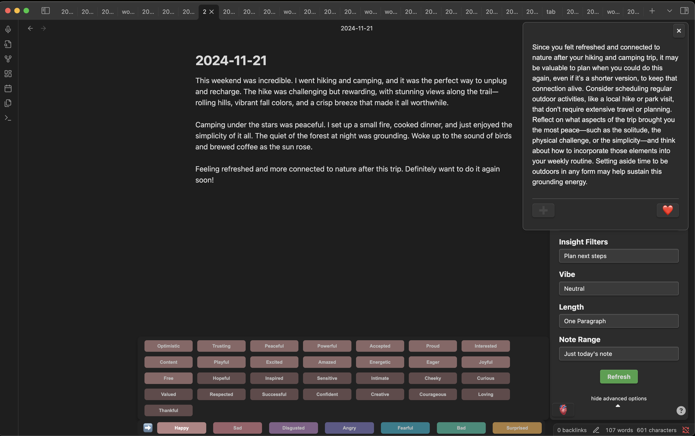

Here's the updated README with emphasis on data privacy and OpenAI processing:

# Mind Mirror - Obsidian Plugin

Mind Mirror is a powerful AI journaling tool that provides real-time feedback and insights on your writing. Choose the type of therapy, what type of insights you want, and get AI generations inside of Obsidian to help you dive deeper.

## Privacy & Data Handling

**Your Privacy is Our Priority:**
- No data is collected, stored, or processed on our servers
- Your journal entries are only temporarily sent to OpenAI for processing and are not retained
- You can use either your personal OpenAI API key or Mind Mirror's API key
- When using Mind Mirror's API key, your data is simply passed through to OpenAI and returned to your local Obsidian app without being stored

## Getting Started

### Installation

1. **Clone the Repository:**
   ```bash
   git clone <repository_url>
   cd mind-mirror
   ```

2. **Configure API Key:**
   - Open up Obsidian settings
   - Enter your personal OpenAI API key
   - The API key is stored locally and used only for direct communication with OpenAI

3. **Build and Run:**
   ```bash
   npm install
   npm run build
   npm run dev
   ```

### Usage

1. **Load the Plugin:**
   - Open Obsidian
   - Go to `Settings` > `Community Plugins` > `Installed Plugins`
   - Open that folder
   - Place the cloned repo in this location

2. **Configure the Plugin:**
   - In Obsidian, navigate to the Mind Mirror settings to customize your experience

3. **Use the Plugin:**
   - Select your preferred type of therapy, insight filter, and length from the dropdown menus
   - Press the `Refresh` button to get feedback and insights on your journal entry
   - Press the heart button to add the current AI response to a note called "AI Feedback"
   - Press the "+" button to append the AI response to the bottom of the current note

All interactions with the AI are processed securely through OpenAI's API, ensuring your personal data remains private and protected.

# Screenshots

